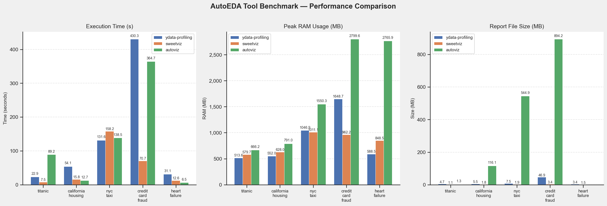
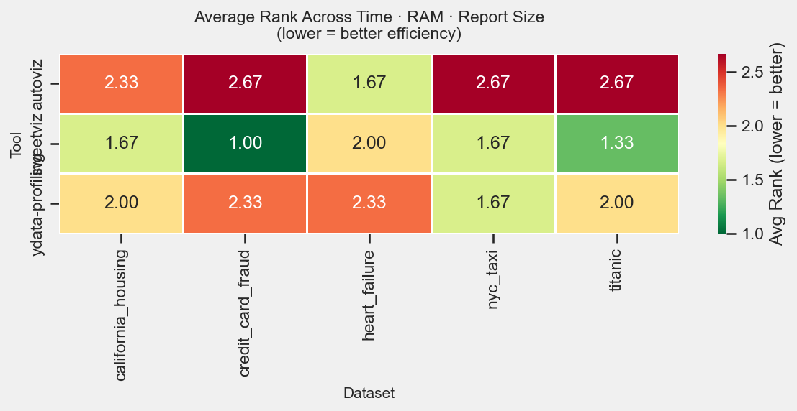
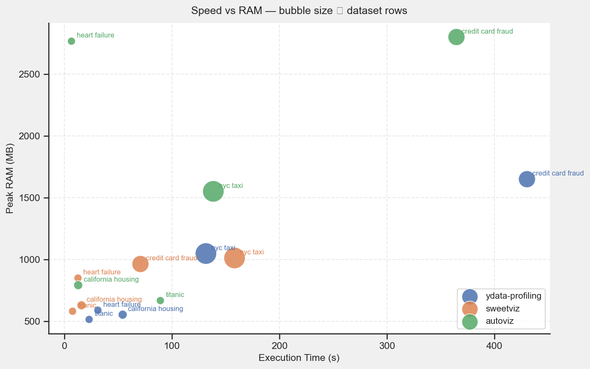

# 📊 AutoEDA-Bench: Automated Exploratory Data Analysis Performance Suite

**AutoEDA-Bench** is a comprehensive benchmarking framework designed to evaluate the trade-offs between speed, memory efficiency, and qualitative depth in modern automated EDA (Exploratory Data Analysis) libraries. By stress-testing tools across diverse data scales (from <1k to 150k+ rows), this project provides a data-driven guide for selecting the optimal visualization engine for any data science workflow.


---

## 🎯 Project Goal
To move beyond subjective preferences and establish a quantitative performance profile for the top three Python AutoEDA libraries (**ydata-profiling**, **Sweetviz**, and **AutoViz**) based on computational overhead and report utility.

---

## 🧬 System Architecture
The pipeline utilizes a modular "Timed-Execution" logic to ensure fair comparisons:

1.  **Dataset Orchestration:** Loading 5 distinct datasets (Titanic, California Housing, NYC Taxi, Credit Card Fraud, Heart Failure) ranging from small classification to high-dimensional imbalanced data.
2.  **Telemetry Wrapper:** A custom `timed_run` function using `tracemalloc` to capture precise **Peak RAM (MB)** and **Elapsed Time (s)** during report generation.
3.  **Cross-Tool Execution:** Sequential execution of `ProfileReport`, `analyze`, and `AutoViz` classes under standardized constraints (`max_rows=150k`).
4.  **Metric Aggregation:** Consolidating raw logs with manual quality ratings (1–5 stars) to calculate an **Efficiency Rank**.
5.  **Visualization Layer:** Generating performance heatmaps and bubble charts to illustrate the "Speed vs. RAM" Pareto frontier.


---

## 🛠️ Technical Stack
| Layer | Tools | Purpose |
| :--- | :--- | :--- |
| **Orchestration** | Python 3.11, Pathlib | Directory management and pipeline flow |
| **Benchmark Targets** | ydata-profiling, Sweetviz, AutoViz | The EDA engines under evaluation |
| **Monitoring** | Tracemalloc, Time | Low-level system resource tracking |
| **Data Analysis** | Pandas, NumPy | Metric aggregation and ranking logic |
| **Visualization** | Matplotlib, Seaborn | Heatmaps, bubble charts, and bar plots |

---

## 📊 Performance & Results
* **The Efficiency Leader:** **Sweetviz** emerged as the most hardware-efficient tool, maintaining a sub-1 GB RAM profile even on 150k rows.
* **Scalability Limit:** Identified significant memory spikes in **AutoViz** (2.8 GB) and **ydata-profiling** (1.5 GB+) on high-dimensional datasets.
* **The "AutoViz Wall":** Documented a specific interaction bottleneck in AutoViz where high-dimensionality caused rendering hangs, resolved by pivoting from `html` to static `png` formats.
* **Storage Cost:** Quantified a massive variance in report sizes, with AutoViz generating up to **894 MB** of assets for complex data compared to Sweetviz’s **3.4 MB** for the same data.


---

## 📂 Project Structure
```text
AutoEDA-Bench/
├── benchmarks/             # Final Performance Assets
│   ├── benchmark_results.csv     # Raw logs (Time, RAM, Size)
│   ├── summary_table.csv         # Quality-weighted metrics
│   ├── rank_heatmap.png          # Avg rank visualization
│   └── speed_vs_ram_scatter.png  # Bubble chart (Speed vs RAM)
├── reports/                # Generated EDA Reports
│   ├── titanic_sweetviz.html
│   ├── nyc_taxi_ydata.html
│   └── credit_card_fraud_autoviz/ # Directory of static charts
├── data/                   # Source Datasets (CSV)
├── eda_benchmark.ipynb     # The 15-cell execution pipeline
└── requirements.txt        # Benchmark dependencies
```

---

## ⚙️ Installation & Setup

### 1. Environment Setup
```bash
git clone https://github.com/declerke/AutoEDA-Bench.git
cd AutoEDA-Bench
python -m venv .venv
source .venv/bin/activate  # Windows: .venv\Scripts\activate
pip install -r requirements.txt
```

### 2. Execute Benchmark
Run the `eda_benchmark.ipynb` notebook. The script will automatically iterate through all dataset-tool combinations, logging performance in real-time.

### 3. Review Results
Visualizations and summary tables are automatically exported to the `/benchmarks` directory upon completion.

---

## 🖼️ Culmination Gallery
*Below are the visual outputs that summarize the findings of this benchmark.*

| Performance Distribution | Efficiency Heatmap | Speed vs. RAM Bubble Chart |
| :---: | :---: | :---: |
|  |  |  |

---

## 🎓 Skills Demonstrated
* **System Resource Monitoring:** Using `tracemalloc` for deep-dive peak memory analysis during runtime.
* **Performance Benchmarking:** Designing a controlled environment to compare disparate software libraries.
* **Data Normalization:** Creating a weighted ranking system to compare tools across units of seconds, megabytes, and qualitative stars.
* **Operational Troubleshooting:** Identifying and mitigating library-specific bottlenecks (e.g., Bokeh/HoloViews render limits in high-cardinality data).
